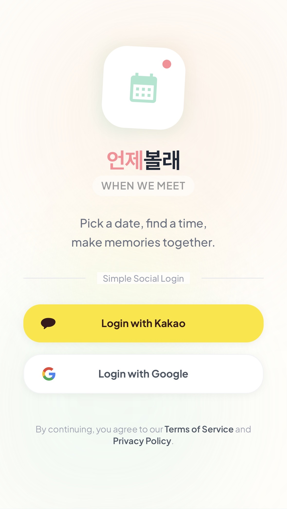
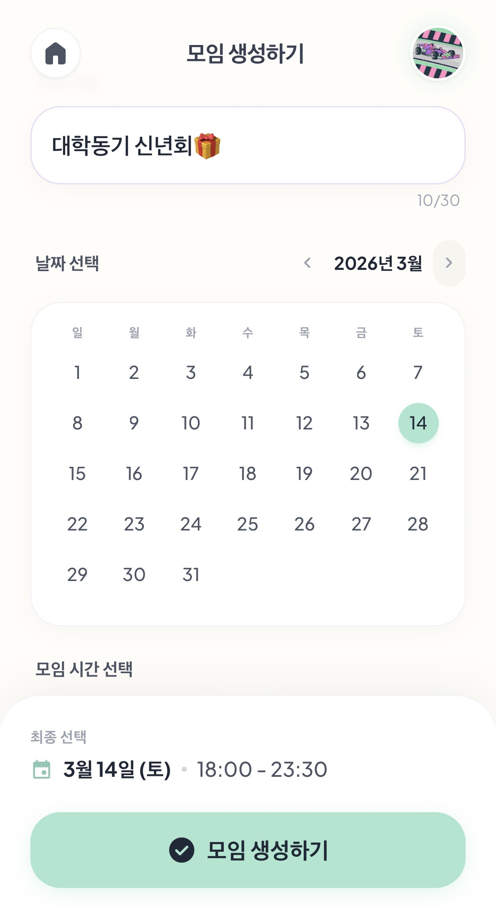
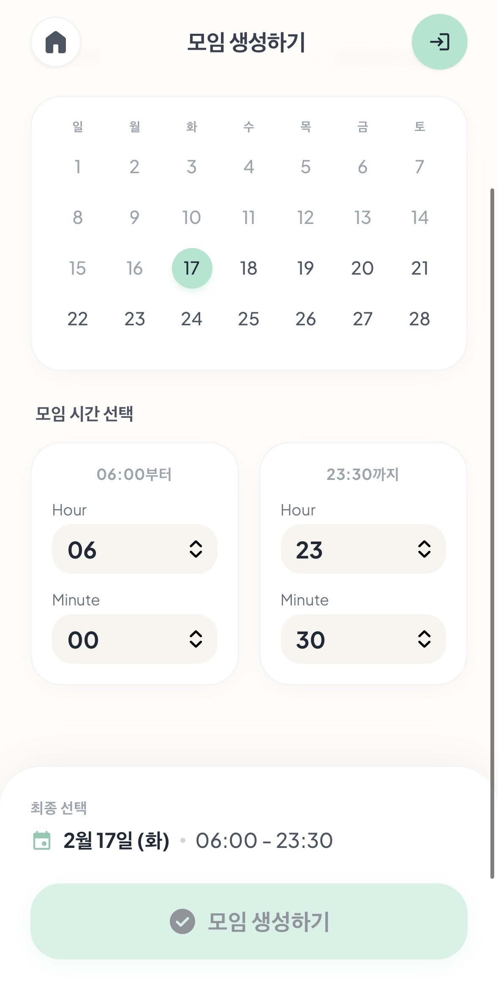
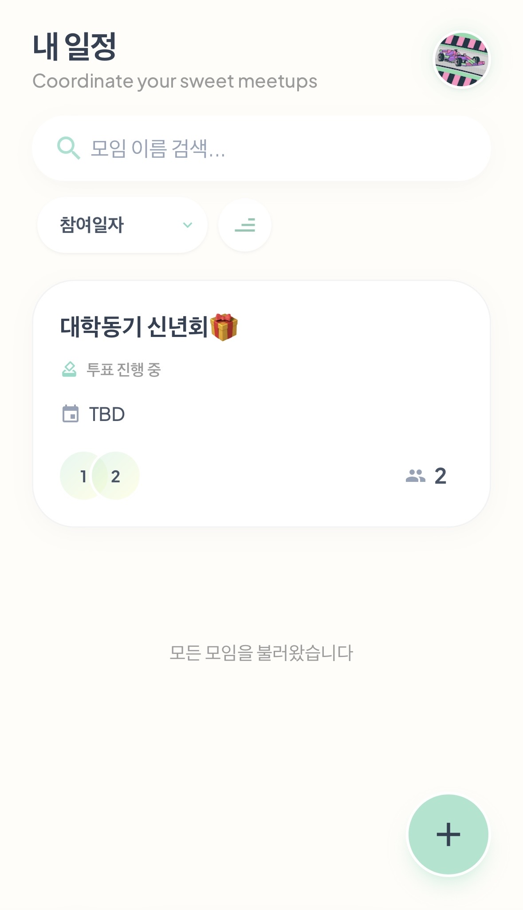
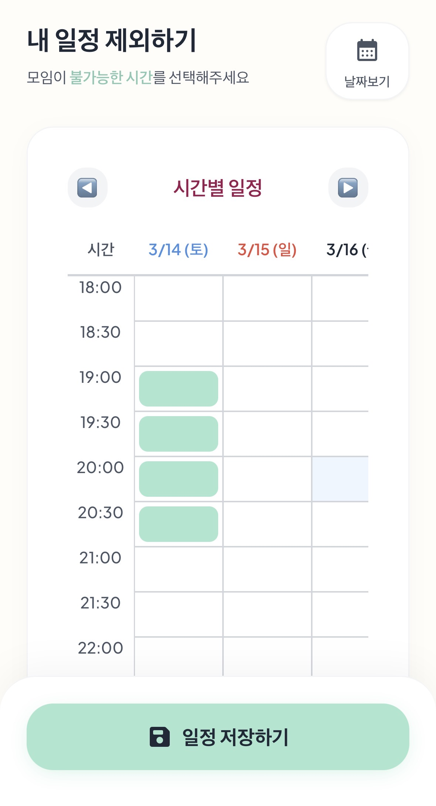
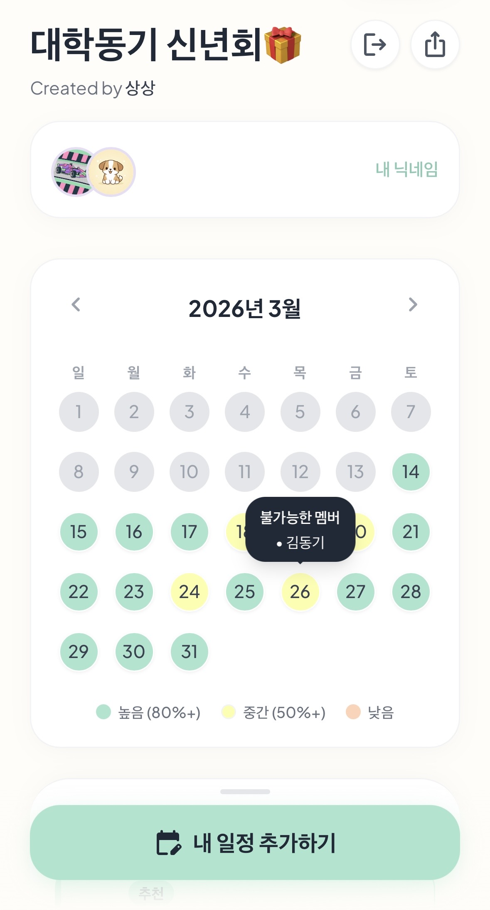
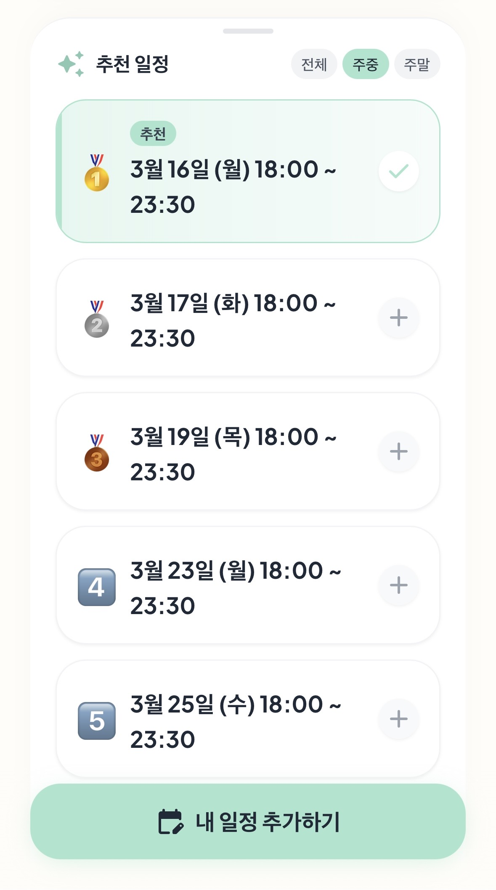
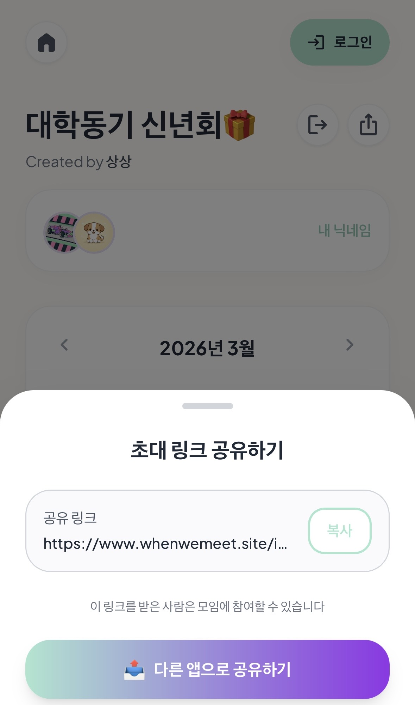
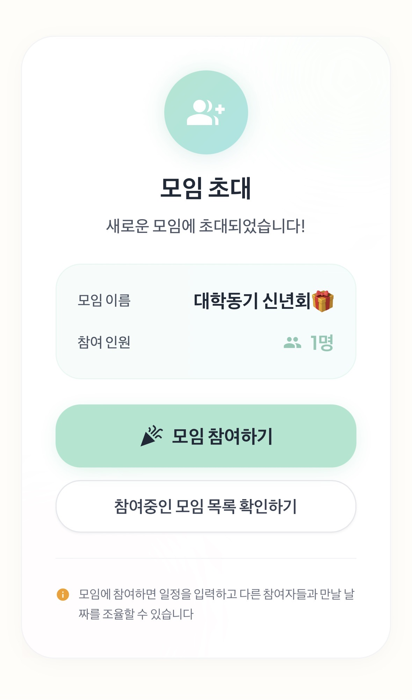

# 🗓️ When We Meet

> 여러 사람의 일정을 손쉽게 조율하고 최적의 만남 시간을 찾아주는 스케줄 조율 서비스

## 📋 프로젝트 소개

**When We Meet**은 여러 참여자의 가능한 시간을 수집하고 비교하여, 모두가 참석 가능한 최적의 모임 시간을 찾아주는 웹 서비스입니다. 팀 미팅, 스터디 그룹, 친구 모임 등 다양한 상황에서 일정 조율의 번거로움 해결을 목표로 서비스를 기획했습니다.


## 🚀 시작하기

### 서비스 접속:
- 언제볼래? : https://whenwemeet.site/

## 📊 개발 정보

- **개발 기간**: 2026.01.25 ~ 2026.02.16 (23일)
- **개발 인원**: 1인(개인 프로젝트)


## ✨ 주요 기능

### 1️⃣ 소셜 로그인
Google과 Kakao 계정으로 간편하게 로그인할 수 있습니다. 별도의 회원가입 없이 소셜 계정을 통해 빠르게 서비스를 이용할 수 있습니다.



**주요 기능:**
- Google OAuth 2.0 로그인
- Kakao OAuth 2.0 로그인
- JWT 기반 인증 시스템
- 자동 로그인 유지
- 서비스 이용중 로그인시 지금까지의 사용데이터 자동 이관

---

### 2️⃣ 미팅 생성
새로운 미팅룸을 생성하고 일정 조율을 시작합니다. 미팅 제목, 설명, 후보 날짜를 설정할 수 있습니다.

<p>
  
  
</p>

**주요 기능:**
- 미팅 제목 및 설명 작성
- 후보 날짜 범위 설정
- 미팅 생성 후 자동으로 관리자 지정
- 생성 즉시 초대 링크 발급

---

### 3️⃣ 미팅 목록 조회
참여 중인 모든 미팅을 한눈에 확인할 수 있습니다. 



**주요 기능:**
- 내가 생성한 미팅 목록
- 참여 중인 미팅 목록
- 미팅 상태 표시 (진행 중, 완료 등)
- 미팅 상세 페이지로 빠른 이동

---

### 4️⃣ 스케줄 입력
직관적인 캘린더 UI를 통해 자신의 일정을 기록합니다. 날짜별/시간별로 모임이 어려운 시간을 쉽게 선택할 수 있습니다.

<p>
  
  
</p>

**주요 기능:**
- 시간 단위 스케줄 선택 (30분 단위)
- 드래그로 연속 시간 선택
- 이미 입력한 스케줄 수정 가능
- 실시간 저장 및 반영

---

### 5️⃣ 미팅 상세 및 결과 확인
모든 참여자의 스케줄을 종합하여 최적의 시간을 확인할 수 있습니다. 하루중 만날 수 있는 가장 긴 시간을 보여줍니다.

<p>
  
  
</p>

**주요 기능:**
- 참여자별 가능 시간 현황
- 겹치는 시간대를 색상으로 표시 (많이 겹칠수록 진한 색)
- 최적 시간대 자동 추천
- 참여자 목록 현황
- 미팅 정보 수정 (관리자만)

---

### 6️⃣ 초대 링크 공유
생성된 미팅의 초대 링크를 복사하여 카카오톡, 이메일 등으로 간편하게 공유할 수 있습니다.

<p>
  
  
</p>

**주요 기능:**
- 원클릭 링크 복사
- 링크를 통한 미팅 참여
- 게스트 사용자도 참여 가능
- 참여자 닉네임 설정

## 🛠️ 기술 스택

### Frontend
- **Framework**: 
- **Styling**: 
- **State Management**: 
- **HTTP Client**: 
- **Web Server**: 

### Backend
- **Framework**: 
- **Language**: 
- **Security**:  + OAuth2
- **Authentication**: 
- **ORM**:  + QueryDSL
- **Database**: 
- **Cache**: 

### Infrastructure
- **Containerization**: 
- **Orchestration**: 
- **CI/CD**: 

## 📁 프로젝트 구조

```
when-we-meet/
├── frontend/              # Vue.js 프론트엔드
│   ├── src/
│   │   ├── pages/        # 페이지 컴포넌트
│   │   ├── components/   # 재사용 컴포넌트
│   │   ├── stores/       # Pinia 스토어
│   │   └── router/       # 라우팅 설정
│   └── nginx.conf        # Nginx 설정
│
├── backend/              # Spring Boot 백엔드
│   └── src/main/java/com/whenwemeet/backend/
│       ├── domain/       # 도메인 로직
│       │   ├── auth/     # 인증/인가
│       │   ├── user/     # 사용자 관리
│       │   ├── meetingRoom/  # 미팅룸
│       │   └── schedule/ # 일정 관리
│       └── global/       # 공통 설정
│
├── docker-compose.yml    # Docker 컨테이너 구성
└── Jenkinsfile          # CI/CD 파이프라인
```

---

**When We Meet** - 만남의 시작, 일정 조율은 간편하게 ✨
